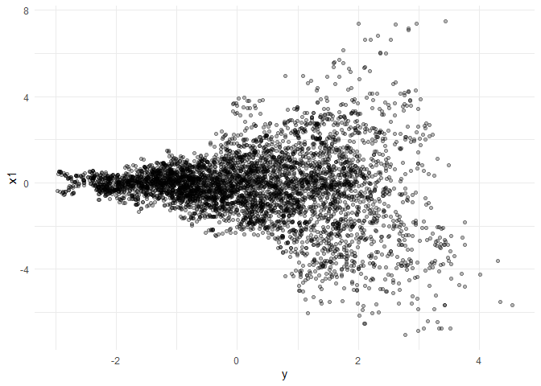

<!-- README.md is generated from README.Rmd. Please edit that file -->

# R.NURS

<!-- badges: start -->

<!-- badges: end -->

A Base R, simple implementation of the No-Underrun Sampler. This
package aims to mostly directly implement the algorithm as
described by the paper, with at most small changes for code aesthetics
and performance. This version uses the memory saving technique described
in section 2.2.

This code doesn’t parallelize the density calculation for orbit
extensions but doing so is trivial.

## Installation

You can install the development version of R.NURS from
[GitHub](https://github.com/) with:

``` r
# install.packages("pak")
pak::pak("VisruthSK/R.NURS")
```

## Example: Neal’s Funnel

``` r
library(R.NURS)
library(ggplot2)

set.seed(0)
logpdf_funnel <- function(theta) {
  y <- theta[1]
  dnorm(y, 0, 3, log = TRUE) + sum(dnorm(theta[-1], 0, exp(y / 2), log = TRUE))
}

samples <- NURS(
  logpdf_funnel,
  theta_init = rep(0, 15),
  n = 5000,
  epsilon = 0.1,
  h = 0.5,
  M = 5
)

data.frame(y = samples[, 1], x1 = samples[, 2]) |>
  ggplot(aes(x = y, y = x1)) +
  geom_point(alpha = 0.3) +
  theme_minimal()
```



## References

- Nawaf Bou-Rabee, Bob Carpenter, Sifan Liu, Stefan Oberdörster. 2025.
  [The No-Underrun Sampler: A locally adaptive, gradient free, MCMC
  method](https://arxiv.org/abs/2501.18548v2). *arXiv* 2501.18548 v2.

- Art B. Owen. 2013. [Monte Carlo theory, methods and
  examples](https://artowen.su.domains/mc/). *artowen.su.domains*.
